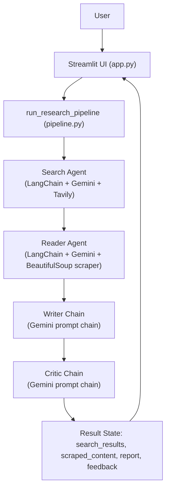
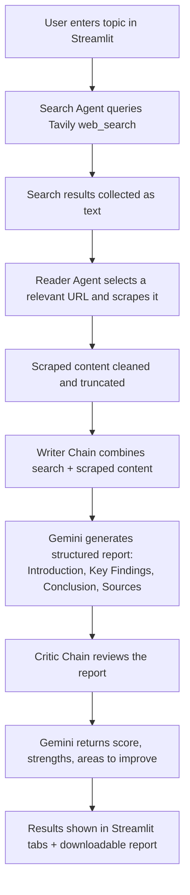

# 🤖 Multi-Agent AI Research System

**An autonomous, multi-agent pipeline that searches the web, reads sources, writes a structured report, and critiques its own output — built with LangChain, Gemini, and Streamlit.**


This project coordinates four specialized AI agents — a **Search Agent**, **Reader Agent**, **Writer Chain**, and **Critic Chain** — into a single pipeline that takes any research topic and returns a factual, structured report along with a self-critique of that report. It's designed for anyone who needs a fast, source-grounded first draft on a topic: students, analysts, content teams, or developers exploring multi-agent LLM orchestration. The system solves the "blank page" problem in research writing by automating the search → read → synthesize → review loop end-to-end.

---

## 🚀 Project Overview

**Problem:** Producing a well-sourced research report on a new topic is slow — it requires searching, filtering credible sources, reading them, and synthesizing findings into a coherent write-up.

**Solution:** This system automates the entire loop using coordinated LLM agents, each responsible for one stage of the process, so a user only needs to supply a topic.

**Target users:** Developers learning multi-agent orchestration with LangChain, and anyone who wants a quick, structured research draft to build on.

**Key value:** Turns a single topic string into a search summary, scraped source content, a structured report, and an honest critique of that report — all in one run, visible through a live Streamlit UI.

---

## 🎯 Objectives

- Automate web research for a given topic using a dedicated search agent
- Automatically identify and scrape the most relevant source for deeper detail
- Synthesize search results and scraped content into a structured, factual report
- Provide an independent, structured critique of the generated report
- Expose the entire pipeline through an interactive Streamlit interface

---

## ✨ Key Features

### Core Features
- End-to-end pipeline: topic in → report + critique out
- Real-time web search via the Tavily API
- Automated web scraping and text extraction with BeautifulSoup
- Downloadable Markdown report output

### ML/AI Features
- Four purpose-built LangChain components: two tool-using agents (Search, Reader) and two prompt chains (Writer, Critic)
- Powered by Google's `gemini-2.5-flash` model (`temperature=0` for consistent, factual output)
- Structured-response normalizer (`extract_text`) that safely handles LangChain messages, dicts, and content-block lists from the agents

### User Interface Features
- Streamlit web app with a visual 4-stage pipeline overview
- Tabbed results view: Search Results, Scraped Content, Final Report, Critic Review
- Progress indicator while the pipeline runs
- One-click Markdown report download

### Engineering Features
- Clear separation of concerns across `agents.py`, `pipeline.py`, `tools.py`, and `app.py`
- Environment-variable-based configuration via `.env` / `python-dotenv`
- Defensive error handling for scraping failures and pipeline exceptions

---

## 🏗️ System Architecture



**Component breakdown:**
- **Streamlit UI (`app.py`)** — collects the topic, triggers the pipeline, renders results in tabs.
- **Pipeline (`pipeline.py`)** — orchestrates the four stages in sequence and normalizes each stage's output into plain text.
- **Search Agent** — a LangChain agent bound to a Tavily-powered `web_search` tool.
- **Reader Agent** — a LangChain agent bound to a `scrape_url` tool that fetches and cleans page text with BeautifulSoup.
- **Writer Chain** — a prompt → Gemini → `StrOutputParser` chain that synthesizes a structured report.
- **Critic Chain** — a prompt → Gemini → `StrOutputParser` chain that scores and reviews the report.

---

## 🔄 Project Workflow



---

## 🛠️ Tech Stack

| Category | Technology |
|---|---|
| Language | Python |
| LLM Orchestration | LangChain (`create_agent`, prompt chains) |
| LLM | Google Gemini (`gemini-2.5-flash` via `langchain-google-genai`) |
| Agent Framework | LangGraph |
| Web Search | Tavily API (`tavily-python`) |
| Web Scraping | BeautifulSoup4, Requests, lxml |
| Frontend | Streamlit |
| Configuration | python-dotenv |
| HTTP Client | httpx |
| Monitoring (optional) | LangSmith |

---

## 📁 Project Structure

```
MULTI-AGENT-AI-RESEARCH-SYSTEM/
│
├── agents.py           # Defines the Search Agent, Reader Agent, Writer Chain, and Critic Chain
├── pipeline.py          # Orchestrates the 4-stage pipeline and normalizes agent output to text
├── tools.py             # web_search (Tavily) and scrape_url (BeautifulSoup) tool definitions
├── app.py                # Streamlit UI: input, progress tracking, tabbed results, report download
├── requirements.txt    # Python dependencies
├── .env.example          # Template for required API keys
└── .gitignore
```

---

## ⚙️ Installation & Setup

### Clone Repository

```bash
git clone https://github.com/harshantla-cloud/MULTI-AGENT-AI-RESEARCH-SYSTEM.git
cd MULTI-AGENT-AI-RESEARCH-SYSTEM
```

### Create a Virtual Environment

```bash
python -m venv venv
source venv/bin/activate      # On Windows: venv\Scripts\activate
```

### Install Dependencies

```bash
pip install -r requirements.txt
```

### Configure Environment Variables

Copy `.env.example` to `.env` and add your API keys:

```bash
cp .env.example .env
```

```env
GOOGLE_API_KEY=your_google_api_key_here
TAVILY_API_KEY=your_tavily_api_key_here
```

- `GOOGLE_API_KEY` — required for the Gemini model (get one from Google AI Studio)
- `TAVILY_API_KEY` — required for the Tavily web search tool

### Run the App

**Streamlit UI:**
```bash
streamlit run app.py
```

**Command-line pipeline:**
```bash
python pipeline.py
```

---

## 🖥️ Application

The Streamlit interface displays the four-agent pipeline visually, accepts a research topic, and runs the full pipeline with a live progress indicator. Results are organized into four tabs — **Search Results**, **Scraped Content**, **Final Report**, and **Critic Review** — and the final report can be downloaded directly as a Markdown file. *(No application screenshots were included in the repository — add them under an `images/` folder and reference them here once available.)*

---

## 📈 Results

Model performance metrics, benchmark scores, and evaluation datasets are **not specified** in the repository — this project's output is qualitative (a generated report and a critic review), not a quantitative ML model, so no accuracy/precision-style metrics apply.

---

## 🔮 Future Improvements

- Add a `LICENSE` file to clarify usage terms
- Add automated tests for the `extract_text` normalizer and scraping tool
- Cache search/scrape results to reduce redundant API calls
- Add screenshots of the Streamlit UI to this README

---

## 👤 Author

**Harsh**
B.Tech CSE (2023–2027) · Data Science & Machine Learning
[GitHub](https://github.com/harshantla-cloud) · [LinkedIn](https://linkedin.com/in/harsh-5694b13ab)
