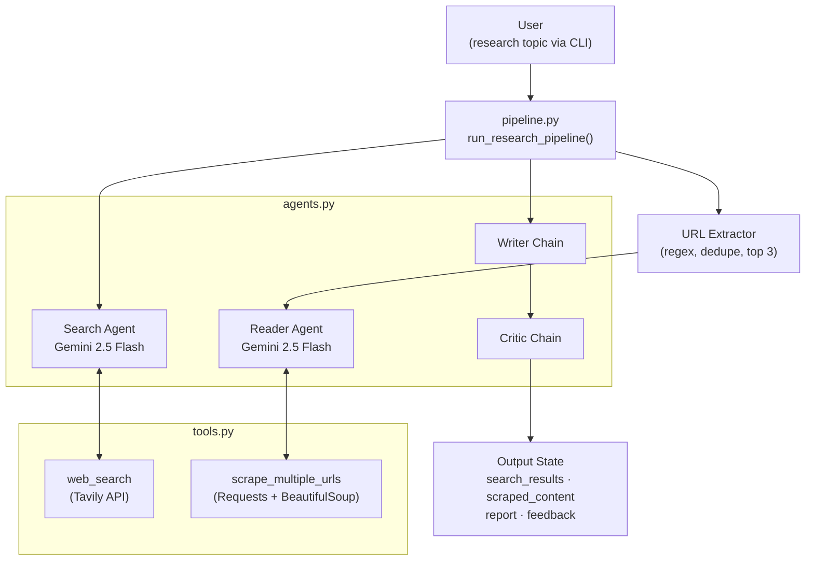
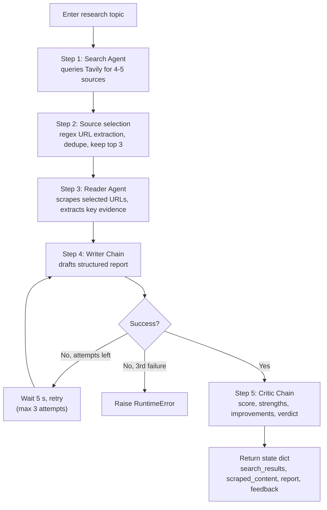

# Multi-Agent AI Research System

**A multi-agent LLM pipeline that searches the web, reads sources, writes a cited research report, and critiques its own output.**

[](https://github.com/harshantla-cloud/MULTI-AGENT-AI-RESEARCH-SYSTEM)


Given a research topic, the system uses specialised agents to find sources, extract evidence from them, and produce a structured report with source URLs, followed by an automated quality review. It is built for students, analysts and developers who want a fast, source-grounded first draft of a research brief instead of manually searching, reading and summarising.

---

## 🚀 Project Overview

| | |
|---|---|
| **Problem** | Researching a topic means searching, opening several pages, extracting the relevant facts, and keeping track of where each claim came from. This is slow and easy to do inconsistently. |
| **Solution** | A five-stage pipeline in which each stage has a single responsibility: a **Search Agent** finds sources, a **Reader Agent** scrapes and condenses them, a **Writer Chain** drafts the report, and a **Critic Chain** reviews it. |
| **Target users** | Students, analysts, and developers who need a quick, source-attributed research draft. |
| **Use case** | Enter a topic in the terminal and receive search results, extracted evidence, a structured report, and a critic review in a single run. |
| **Key value** | Every report is grounded in retrieved web content, keeps source URLs attached to claims, and ships with a built-in review step. |

---

## 🎯 Objectives

- Automate multi-source web research from a single topic prompt.
- Separate concerns across agents (search, reading, writing, critique) rather than using one monolithic prompt.
- Keep generated reports grounded in retrieved content, with source URLs preserved.
- Provide an automated review of each report covering factual quality, source usage, clarity and completeness.
- Handle transient LLM API failures gracefully with retry logic in the writing stage.

---

## ✨ Key Features

### Core Features
- End-to-end research flow: **topic → sources → evidence → report → review**.
- Returns all intermediate artifacts (`search_results`, `scraped_content`, `report`, `feedback`) as a single Python dictionary, so the pipeline can be reused programmatically.
- Command-line entry point for running a full research session interactively.

### AI / LLM Features
- **Two tool-using agents** built with LangChain's `create_agent`: one with a web-search tool, one with a multi-URL scraping tool.
- **Two prompt chains** (`ChatPromptTemplate | LLM | StrOutputParser`) for report writing and report critique.
- Writer prompt instructs the model to use only the gathered research and keep source URLs attached to claims.
- Critic output follows a fixed format: score out of 10, strengths, areas to improve, source quality, and a one-line verdict.
- Deterministic generation (`temperature=0`) across all stages.

### Engineering Features
- **URL de-duplication** in the search tool and in the pipeline's URL extractor.
- **Regex-based URL extraction** that is independent of how the Search Agent formats its output.
- **Source cap**: the top 3 URLs are passed to the Reader Agent to keep latency and token usage bounded.
- **Resilient scraping**: 8-second request timeout, browser-style User-Agent, per-URL error capture, and removal of non-content HTML elements (`script`, `style`, `nav`, `footer`, `header`, `aside`).
- **Retry logic**: the Writer Chain is attempted up to 3 times with a 5-second delay between attempts.
- **Response normalisation**: a recursive `extract_text` helper converts LangChain/Gemini message objects, dicts and lists into clean text.
- **Secrets management**: API keys loaded from `.env` via `python-dotenv`; `.env` is git-ignored and an `.env.example` template is provided.

---

## 🏗️ System Architecture


```mermaid
flowchart TB
    U["User<br/>(research topic via CLI)"] --> P["pipeline.py<br/>run_research_pipeline()"]

    subgraph AG["agents.py"]
        SA["Search Agent<br/>Gemini 2.5 Flash"]
        RA["Reader Agent<br/>Gemini 2.5 Flash"]
        WC["Writer Chain"]
        CC["Critic Chain"]
    end

    subgraph TL["tools.py"]
        T1["web_search<br/>(Tavily API)"]
        T2["scrape_multiple_urls<br/>(Requests + BeautifulSoup)"]
    end

    P --> SA
    SA <--> T1
    P --> UE["URL Extractor<br/>(regex, dedupe, top 3)"]
    UE --> RA
    RA <--> T2
    P --> WC
    WC --> CC
    CC --> OUT["Output State<br/>search_results · scraped_content<br/>report · feedback"]
```

| Component | File | Responsibility |
|---|---|---|
| **Orchestrator** | `pipeline.py` | Runs the five stages in order, extracts and selects URLs, applies retry logic, and returns the combined state. |
| **Search Agent** | `agents.py` | Gemini-powered agent with the `web_search` tool; returns 4–5 relevant sources with title, URL and relevance note. |
| **Reader Agent** | `agents.py` | Gemini-powered agent with the `scrape_multiple_urls` tool; extracts key evidence per source and keeps sources separated. |
| **Writer Chain** | `agents.py` | Prompt chain that turns gathered research into a structured report: Introduction, Key Findings (minimum 3), Conclusion, Sources. |
| **Critic Chain** | `agents.py` | Prompt chain that scores and reviews the report in a fixed format. |
| **Search tool** | `tools.py` | Calls Tavily (`max_results=5`), de-duplicates URLs, and returns title, URL and a 400-character snippet per source. |
| **Scraper tool** | `tools.py` | Fetches each URL, strips non-content tags, and returns up to 3,000 characters of text per page. |

---

## 🔄 Project Workflow


```mermaid
flowchart TD
    A["Enter research topic"] --> B["Step 1: Search Agent<br/>queries Tavily for 4-5 sources"]
    B --> C["Step 2: Source selection<br/>regex URL extraction, dedupe, keep top 3"]
    C --> D["Step 3: Reader Agent<br/>scrapes selected URLs, extracts key evidence"]
    D --> E["Step 4: Writer Chain<br/>drafts structured report"]
    E --> F{"Success?"}
    F -- "No, attempts left" --> G["Wait 5 s, retry<br/>(max 3 attempts)"]
    G --> E
    F -- "No, 3rd failure" --> X["Raise RuntimeError"]
    F -- "Yes" --> H["Step 5: Critic Chain<br/>score, strengths, improvements, verdict"]
    H --> I["Return state dict<br/>search_results, scraped_content, report, feedback"]
```

1. **Search**: the Search Agent calls the Tavily-backed `web_search` tool and returns sources with title, URL and a relevance note.
2. **Source selection**: URLs are pulled from the agent's text with a regular expression, de-duplicated, and trimmed to the first three. The pipeline raises an error if none are found.
3. **Read**: the Reader Agent scrapes all selected URLs through a single tool call and returns per-source key evidence.
4. **Write**: the Writer Chain combines the topic, search results and extracted evidence into a report, with up to three attempts.
5. **Review**: the Critic Chain evaluates the final report and returns structured feedback.

---

## 🤖 Models & Components

This project is an LLM-orchestration system. It does not train a machine learning model, and it uses no dataset, feature engineering or train/test split, so those sections are intentionally omitted.

| Component | Type | Model / Tool | Purpose |
|---|---|---|---|
| Search Agent | Tool-using agent | `gemini-2.5-flash` + `web_search` (Tavily) | Discover relevant, reliable sources |
| Reader Agent | Tool-using agent | `gemini-2.5-flash` + `scrape_multiple_urls` | Extract key evidence from selected sources |
| Writer Chain | Prompt chain | `gemini-2.5-flash` | Produce a structured, source-attributed report |
| Critic Chain | Prompt chain | `gemini-2.5-flash` | Score and review the report |

All components use `ChatGoogleGenerativeAI` with `temperature=0`.

---

## 📈 Evaluation & Results

No quantitative benchmarks, accuracy figures, or sample outputs are recorded in this repository, so none are claimed here.

Quality is assessed at run time by the **Critic Chain**, which returns:

```
Score: X/10
Strengths: ...
Areas to Improve: ...
Source Quality: ...
One line verdict: ...
```

This score is generated by an LLM reviewer and should be treated as a heuristic signal, not a validated metric.

---

## 🛠️ Tech Stack

| Category | Technology |
|---|---|
| Language | Python (development environment: 3.12) |
| LLM | Google Gemini `gemini-2.5-flash` via `langchain-google-genai` |
| Agent / Chain Framework | LangChain (`create_agent`, `ChatPromptTemplate`, `StrOutputParser`) |
| Web Search | Tavily (`tavily-python`) |
| Web Scraping | Requests, BeautifulSoup4 (`html.parser`) |
| Configuration | python-dotenv |
| Version Control | Git / GitHub |

> **Also listed in `requirements.txt`, but not imported by the current source code:** `langgraph`, `langchain-community`, `langchain-tavily`, `google-generativeai`, `lxml`, `httpx`, `streamlit`, `langsmith`.

---

## 📁 Project Structure

```
MULTI-AGENT-AI-RESEARCH-SYSTEM/
│
├── agents.py          # LLM setup, Search/Reader agents, Writer & Critic chains
├── tools.py           # Tavily search tool and multi-URL scraping tool
├── pipeline.py        # Orchestration, URL extraction, retry logic, CLI entry point
├── requirements.txt   # Python dependencies
├── .env.example       # Template for required API keys
├── .gitignore         # Excludes virtual envs, caches, .env, editor files
└── README.md
```

| File | Description |
|---|---|
| `agents.py` | Initialises Gemini and defines `build_search_result()`, `build_reader_agent()`, `writer_chain` and `critic_chain`. |
| `tools.py` | Defines the `web_search` and `scrape_multiple_urls` LangChain tools. Fails fast if `TAVILY_API_KEY` is missing. |
| `pipeline.py` | Defines `run_research_pipeline(topic)`, plus helpers `extract_text` and `extract_urls`. Runs interactively when executed directly. |

---

## ⚙️ Installation & Setup

### Prerequisites
- Python 3.12 (the version used in development)
- A [Google AI (Gemini) API key](https://aistudio.google.com/apikey)
- A [Tavily API key](https://tavily.com/)

### Clone Repository

```bash
git clone https://github.com/harshantla-cloud/MULTI-AGENT-AI-RESEARCH-SYSTEM.git
cd MULTI-AGENT-AI-RESEARCH-SYSTEM
```

### Create and Activate a Virtual Environment

```bash
python -m venv .venv

# Windows
.venv\Scripts\activate

# macOS / Linux
source .venv/bin/activate
```

### Install Dependencies

```bash
pip install -r requirements.txt
```

### Configure Environment Variables

```bash
# Windows
copy .env.example .env

# macOS / Linux
cp .env.example .env
```

Open `.env` and set:

```env
GOOGLE_API_KEY=your_google_api_key
TAVILY_API_KEY=your_tavily_api_key
```

---

## ▶️ Usage

Run the pipeline from the terminal:

```bash
python pipeline.py
```

Enter a research topic when prompted. The program prints each stage as it runs (search results, selected sources, extracted evidence, final report, critic review).

To use it programmatically:

```python
from pipeline import run_research_pipeline

state = run_research_pipeline("your research topic")

state["search_results"]    # sources found by the Search Agent
state["scraped_content"]   # per-source evidence from the Reader Agent
state["report"]            # final structured report
state["feedback"]          # Critic Chain review
```

---

## ⚠️ Current Limitations

- Only the first **3** URLs from the search results are read, and each page is truncated to **3,000** characters.
- Scraping uses plain HTTP requests, so JavaScript-rendered pages and sites that block automated requests may return little or no content.
- Report quality depends on Gemini and the retrieved sources; the critic score is LLM-generated and not independently validated.
- The repository contains no automated tests and no graphical interface; interaction is through the command line.

---

## 👤 Author

**Harsh** — B.Tech in Computer Science & Engineering (2023–2027)
Focus areas: Data Science, Machine Learning, AI, Deep Learning

[](https://github.com/harshantla-cloud)

<!--
Add a license badge and LICENSE file when one is chosen.
Add application screenshots under an `images/` folder and reference them here, e.g.:

-->
